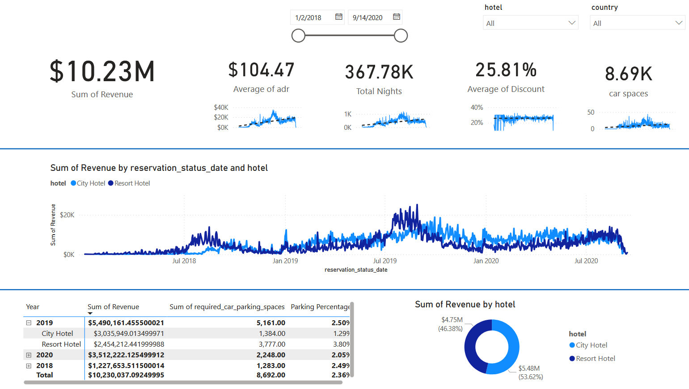

# Hotel-Revenue-Data-Analysis

In this project I did the following: 
1. Build a Database with Excel
2. Analyze and Retrieve Data with SQL
3. Connect Power BI to a Database
4. Visualize Data in Power BI

Stakeholder Requirements:
"Is our hotel revenue growing by year?"

"Should we increase our parking lot size?"

"What trends can we see in the data?"
